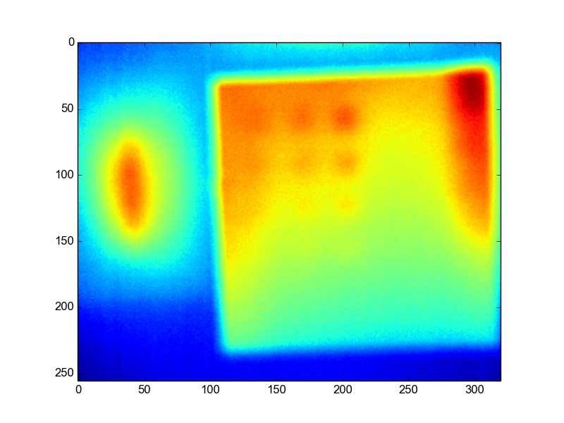
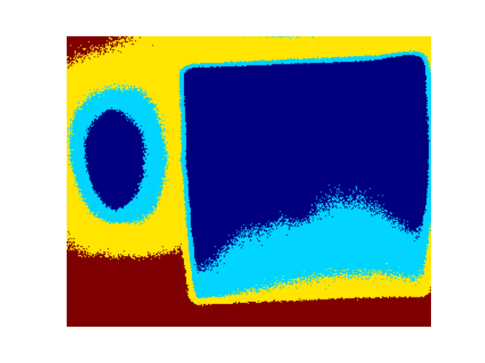
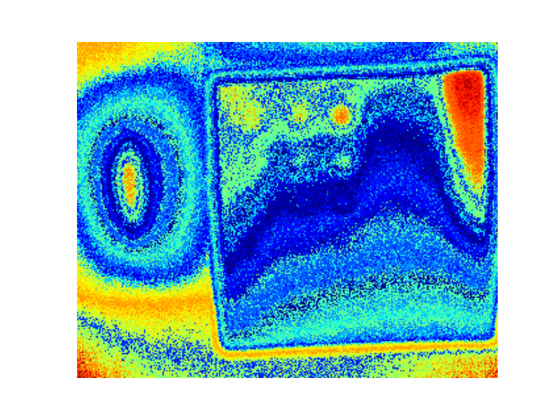

# mean-shift-clustering-algorithm-PYTHON

Mean shift is a non-parametric feature-space analysis technique for locating the maxima of a density function, a so-called mode-seeking algorithm. Application domains include cluster analysis in computer vision and image processing.>> WIKI @https://en.wikipedia.org/wiki/Mean_shift

Mean shift clustering is a general non-parametric cluster finding procedure — introduced by Fukunaga and Hostetler [1], and popular within the computer vision field. Nicely, and in contrast to the more-well-known K-means clustering algorithm, the output of mean shift does not depend on any explicit assumptions on the shape of the point distribution, the number of clusters, or any form of random initialization.
@http://www.chioka.in/meanshift-algorithm-for-the-rest-of-us-python/

DATA- INPUT THERMAL IMAGE:

RESULT IMAGE AFTER MEAN SHIFT WITH quantile=.04, n_samples=1000

RESULT IMAGE AFTER MEAN SHIFT WITH quantile=.004, n_samples=1000

Explore Builtin function from 
@http://scikit-learn.org/stable/modules/generated/sklearn.cluster.MeanShift.html#sklearn.cluster.MeanShift

PYTHON CODE:
check Mean_Shift.py
